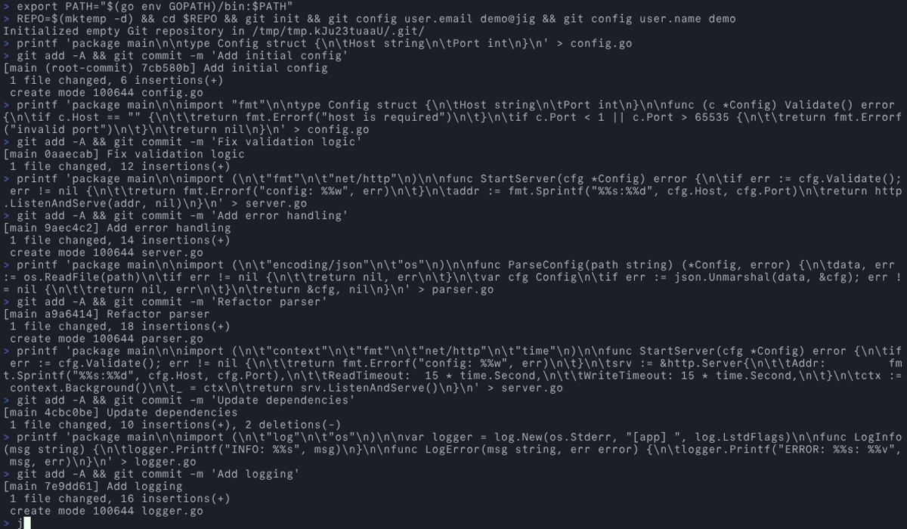

Every developer eventually hits a point where they're spending more effort adapting to a tool than the tool is saving them. You configure it, patch it, fork it, file issues, wait for upstream - and somewhere in that cycle you realize you've been building workarounds around something that was never designed for how you actually work. I hit that point with my Git workflow, and after enough friction I stopped patching and started building. The question isn't whether you can tolerate your tools. It's whether building your own would cost less than the accumulated drag of tools that almost fit.

## The Friction That Adds Up

My daily Git workflow relied on four separate terminal user interface (TUI) tools - one for interactive staging, one for diff navigation, one for history browsing, one for rebase editing. Each was good at its job. None of them talked to each other. Four keybinding schemes, four visual languages, four mental models to switch between throughout the day. The friction was small per-incident but constant.

I could live with the inconsistency. What pushed me over was the feature treadmill. I opened an [issue on forgit](https://github.com/wfxr/forgit/issues/491) asking for delta integration. They fixed it. Then I wanted difftastic support. Then I wanted the diff viewer to behave differently. Each request was reasonable, but I was starting to reshape someone else's tool into something it wasn't designed to be. And forgit was one of four tools - the same pattern was playing out everywhere.

That's the signal. When you're filing your third feature request on the same project, you're not using a tool anymore. You're trying to turn it into a different tool.

## When Building Beats Patching

The instinct is to contribute upstream. Submit PRs, work with maintainers, improve the tool for everyone. That's the right call most of the time. But it stops working when your needs diverge from the maintainer's vision - which is fair, it's their project. You end up maintaining forks across multiple repos, rebasing patches, tracking upstream changes. That's a second job.

Building makes sense when three conditions align: your needs have diverged enough that upstream won't accept what you want, the scope is small enough that you can ship in weeks not months, and the tooling ecosystem supports it. In my case, Go gave me a single static binary and [Bubble Tea v2](https://github.com/charmbracelet/bubbletea) gave me a modern terminal framework. The scope was narrow - I needed my specific workflows, not a general-purpose Git client.

One tool replacing four is less maintenance than four forks of four tools.

## A Jig, Not a Power Tool

In woodworking, a jig is a custom guide you build for a specific repeated cut. It's not a general-purpose tool. It's shaped for exactly the work you do over and over, and it makes that work precise and fast.

That's what I built. [jig](https://github.com/jetm/jig) has 11 commands covering my daily workflows: staging, hunking, diffing, log browsing, fixup commits, interactive rebase, checkout, and reset. That's it. No branch management UI, no merge conflict resolver, no remote operations. Those work fine from the command line.

One theme throughout - OneDark, matching my terminal and editor. One set of keybindings. One navigation model. The tool disappears into the workflow because it was built from the workflow.

The deliberate incompleteness is the point. A jig that tries to do everything is just another general-purpose tool you'll need to file issues against.

## Shape the Tool to Your Hands

With enough time writing code, you develop concrete opinions about how interaction should work. The diff should appear here, not there. This action should be one keystroke, not three. These preferences aren't right or wrong - they're yours, shaped by how you think about the work.

jig isn't better than [lazygit](https://github.com/jesseduffield/lazygit) or [gitui](https://github.com/extrawurst/gitui). Those tools serve their users well. jig serves me because it encodes my specific opinions about how Git interaction should feel. That's the whole value proposition of a personal tool.

The takeaway isn't "use jig" or "use Go and Bubble Tea." It's simpler than that. Pay attention to where you fight your tools. If you're filing feature requests to reshape something into a different thing, ask whether the scope is small enough to just build the thing. The best developer tool is the one shaped for your hands. Build your own [jig](https://github.com/jetm/jig).
