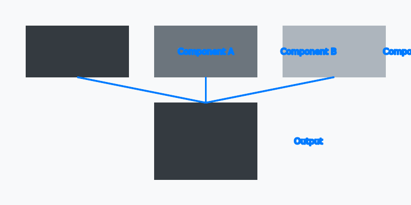

## Introduction

This test post demonstrates all the features documented in the content workflow guide. It serves as both a validation of the page bundle structure and a reference example for future content creation. By the end of this post, you'll see examples of every major Hugo and PaperMod feature in action.

## Table of Contents Testing

The table of contents on this page is automatically generated from the heading structure. Let's explore different heading levels.

### Primary Headings

Primary headings (H3) appear as the main sections in the TOC. They provide logical grouping for related content.

### Secondary Headings

Secondary headings help break down complex topics into manageable chunks.

#### Tertiary Headings

Tertiary headings (H4) offer even finer granularity. Depending on theme configuration, these may or may not appear in the TOC.

## Code Syntax Highlighting

Hugo uses Chroma for syntax highlighting, which supports a wide variety of programming languages. The PaperMod theme includes a code copy button for easy copying.

### Python Example

Here's a Python function demonstrating the Fibonacci sequence:

```python
def fibonacci(n: int) -> list[int]:
    """Generate the first n Fibonacci numbers."""
    if n <= 0:
        return []
    elif n == 1:
        return [0]

    sequence = [0, 1]
    while len(sequence) < n:
        sequence.append(sequence[-1] + sequence[-2])

    return sequence

# Example usage
result = fibonacci(10)
print(f"First 10 Fibonacci numbers: {result}")
```

### JavaScript Example

An async/await pattern for fetching data:

```javascript
async function fetchUserData(userId) {
  try {
    const response = await fetch(`/api/users/${userId}`);

    if (!response.ok) {
      throw new Error(`HTTP error! status: ${response.status}`);
    }

    const userData = await response.json();
    return userData;
  } catch (error) {
    console.error('Failed to fetch user data:', error);
    throw error;
  }
}

// Example usage with async IIFE
(async () => {
  const user = await fetchUserData(123);
  console.log('User:', user.name);
})();
```

### Go Example

A simple HTTP handler in Go:

```go
package main

import (
	"encoding/json"
	"log"
	"net/http"
)

type Response struct {
	Message string `json:"message"`
	Status  int    `json:"status"`
}

func healthHandler(w http.ResponseWriter, r *http.Request) {
	response := Response{
		Message: "Service is healthy",
		Status:  200,
	}

	w.Header().Set("Content-Type", "application/json")
	json.NewEncoder(w).Encode(response)
}

func main() {
	http.HandleFunc("/health", healthHandler)
	log.Println("Server starting on :8080")
	log.Fatal(http.ListenAndServe(":8080", nil))
}
```

### YAML Configuration

An example Hugo front matter configuration:

```yaml
title: "My Blog Post"
date: 2026-01-31T10:00:00Z
draft: false
tags:
  - hugo
  - tutorial
cover:
  image: "cover.jpg"
  alt: "Cover image description"
  relative: true
```

## Image Handling

Hugo's page bundles allow for co-located images that travel with your content.

### Cover Image

The cover image for this post is configured in the front matter using the `cover` field. It specifies:

- **image**: The filename relative to the page bundle (`featured.jpg`)
- **alt**: Accessibility text describing the image
- **caption**: Optional caption displayed below the image
- **relative**: Set to `true` for page bundle resources

### Inline Images

Images can be referenced using standard Markdown syntax with relative paths:



This image is stored alongside the `index.md` file in the page bundle, making it easy to manage and version control together with the content.

## Markdown Features

Let's demonstrate various Markdown formatting options.

### Text Formatting

Hugo supports all standard Markdown text formatting:

- **Bold text** for emphasis
- *Italic text* for subtle emphasis
- ***Bold and italic*** for strong emphasis
- `inline code` for technical terms
- ~~Strikethrough~~ for corrections

> This is a blockquote. It's useful for highlighting important quotes or notes.
> Blockquotes can span multiple lines and contain other Markdown elements.

### Lists

**Unordered list:**

- First item in the list
- Second item with more details
- Third item demonstrating variety
- Fourth item to complete the example

**Ordered list:**

1. First step in the process
2. Second step building on the first
3. Third step continuing the sequence
4. Final step completing the process

**Nested list:**

- Parent item
  - Child item one
  - Child item two
    - Grandchild item
  - Child item three
- Another parent item

### Links

Links can be external or internal:

- External: [Hugo Documentation](https://gohugo.io/documentation/)
- Internal: [Welcome Post](/posts/welcome/)

## Front Matter Reference

Here's a summary of all front matter fields used in this post:

| Field | Value | Purpose |
|-------|-------|---------|
| `title` | "Comprehensive Test Post..." | Page title and H1 heading |
| `date` | 2026-01-31T10:00:00Z | Publication date for sorting |
| `lastmod` | 2026-01-31T10:00:00Z | Last modification timestamp |
| `draft` | true | Prevents publishing until ready |
| `description` | SEO description | Meta description for search engines |
| `slug` | "" | URL path (defaults to directory name) |
| `toc` | true | Enables table of contents |
| `readingTime` | true | Shows estimated reading time |
| `images` | ["featured.jpg"] | Open Graph social sharing image |
| `tags` | ["hugo", "testing", ...] | Topic tags for taxonomy |
| `categories` | ["documentation", ...] | Category taxonomy |
| `outputs` | ["HTML"] | Output formats to generate |
| `cover` | {image, alt, caption, relative} | Cover image configuration |

## Conclusion

This test post has demonstrated:

- Complete front matter with all available fields
- Multiple heading levels for TOC generation
- Code blocks with syntax highlighting in Python, JavaScript, Go, and YAML
- Cover image and inline image handling with page bundles
- Text formatting, lists, and links
- A reference table of front matter fields

Before publishing, remember to follow the pre-publish checklist:

1. Review all content for accuracy
2. Verify images have proper alt text
3. Check that code blocks render correctly
4. Test all links (internal and external)
5. Set `draft: false` when ready to publish
